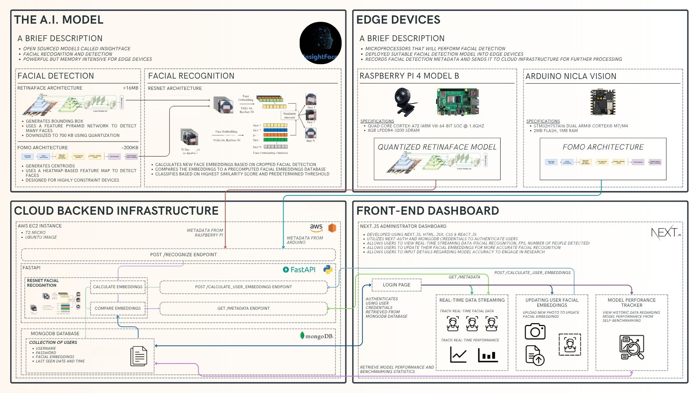

# Face Recognition Multi-Client Suite

This monorepo brings together all pieces of a complete face-recognition pipeline:
- **Clients** that capture camera frames, detect faces locally, and forward crops to the backend  
- **Backend** that extracts embeddings and identifies known users  
- **Web UI** for visualizing recognition results  

---

## Software Architecture



---

## Table of Contents

1. [Subprojects](#subprojects)  
2. [Getting Started](#getting-started)  
3. [Project Structure](#project-structure)  
4. [License](#license)  

---

## Subprojects

### `arduino-client`  
A MicroPython script for the Arduino Nicla Vision board.  
- Connects to Wi-Fi  
- Captures frames and runs a FOMO-based face detector on-device  
- Sends JSON payloads (FPS, people count, base64-encoded face crops) over raw TCP to `/recognize`  

### `raspberry-pi-client`  
A Python/OpenCV client for Raspberry Pi (or any Linux webcam).  
- Grabs frames via OpenCV  
- Runs face detection every _N_ frames using InsightFace  
- Encodes detected faces as base64 and POSTs JSON (FPS, count, boxes, crops) to the backend  
- Renders a live preview window with overlays  

### `backend-client`  
A FastAPI service for face recognition.  
- Accepts base64-encoded face crops  
- Extracts embeddings with InsightFace  
- Stores and queries known-user embeddings in MongoDB  
- Logs requests to `logs.txt` and computes running averages for new user uploads  

### `frontend-client`  
A Next.js application for visualizing recognition results.  
- Displays live detection/count streams  
- Offers user management and history views  
- Bootstrapped with Create Next App and deployable on Vercel  

---

## Getting Started

Each subproject has its own detailed `README.md`. To get started:

```bash
# Clone the repo
git clone https://github.com/yourusername/face-recognition-suite.git
cd face-recognition-suite

# Pick a subfolder and follow its README
cd backend-client
cat README.md
